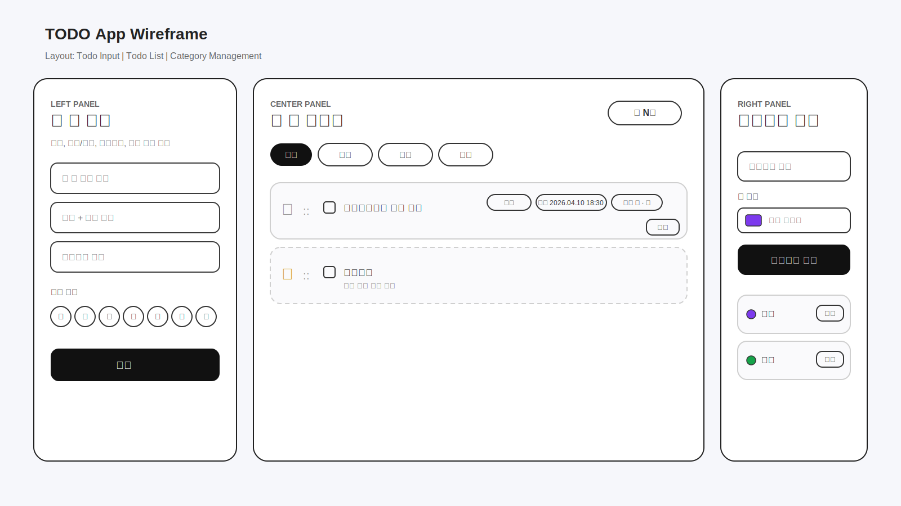

# TODO_list

소프트웨어 공학 미니 프로젝트용 Todo 앱 보고서입니다.

## 1. 프로젝트 개요

- 프로젝트명: Todo 앱
- 목표: 프론트엔드, 백엔드, 데이터베이스를 연결한 Todo 관리 웹 애플리케이션 구현
- 사용 기술:
  - Frontend: React + Vite
  - Backend: Node.js + Express
  - Database: MongoDB Atlas + Mongoose
  - Deploy: Vercel 예정

## 2. 구상 단계

### 2-1. MVP 기능

가장 먼저 구현할 최소 기능은 아래 4가지로 정했다.

- Todo 항목 추가
- Todo 목록 조회
- Todo 완료 체크
- Todo 삭제

처음부터 기능을 많이 넣으면 구조가 꼬일 수 있다고 판단해서, 우선 CRUD가 안정적으로 동작하는 버전을 먼저 완성한 뒤 추가 기능을 붙이는 방식으로 진행했다.

### 2-2. 추가 기능

MVP 이후 확장 목표로 아래 기능들을 순차적으로 추가하기로 했다.

- 마감기한 설정
- 마감 시간 설정
- 요일 반복 기능
- 상단 고정 기능
- 리스트 순서 드래그 변경
- 체크된 항목 자동 하단 정렬
- 카테고리 추가 / 삭제
- 카테고리 색상 지정
- 카테고리 탭으로 모아보기
- 카테고리별 필터링
- 마감 날짜순 정렬

추가 기능도 한 번에 여러 개를 넣지 않고, 하나씩 구현하고 테스트하는 방식으로 진행했다.

### 2-3. UI 와이어프레임

초기 화면 구성은 `할 일 추가 | 할 일 리스트 | 카테고리 관리`의 3단 구조로 구상했다.



와이어프레임 구성 의도는 아래와 같다.

- 왼쪽: 할 일을 입력하고 옵션을 설정하는 입력 영역
- 가운데: 실제 Todo 리스트를 관리하는 핵심 영역
- 오른쪽: 카테고리를 생성, 삭제하고 색상을 관리하는 영역

이 구조를 선택한 이유는 입력, 조회, 분류를 한 화면에서 동시에 다루기 쉽기 때문이다.

## 3. 구현 순서 및 구현 로직

### 3-1. 기본 CRUD 구현

가장 먼저 Todo 앱의 핵심 흐름을 구현했다.

- Todo 생성
- Todo 목록 조회
- Todo 완료 체크
- Todo 삭제

이 단계에서는 메모리 저장 방식으로 먼저 구조를 확인한 뒤, 이후 MongoDB로 확장할 수 있도록 최소 구조로 작성했다.

구현 로직을 이렇게 잡은 이유:

- 먼저 요청-응답 구조를 이해하는 것이 중요하다고 판단했다.
- 저장 구조를 복잡하게 만들기 전에 화면과 API 흐름이 정상 동작하는지 확인하고 싶었다.

### 3-2. MongoDB 연동

기본 CRUD가 동작하는 것을 확인한 뒤 MongoDB Atlas를 연결했다.

- `.env`로 연결 문자열 분리
- `mongoose`로 Todo 스키마 정의
- CRUD API를 DB 기준으로 변경

이 단계에서 로컬 메모리 방식 대신 DB 저장 방식으로 바꾸면서 새로고침 이후에도 데이터가 유지되도록 만들었다.

구현 중 고려한 점:

- 비밀 정보는 코드에 직접 넣지 않고 환경변수로 분리
- 이후 기능 확장을 위해 Todo 데이터를 스키마 기반으로 관리

### 3-3. 마감일시 기능

다음으로 마감기한 기능을 추가했다.

- 처음에는 날짜만 입력하는 형태를 고려했다.
- 하지만 실제 사용성을 생각했을 때 시간 정보까지 있어야 의미가 크다고 판단했다.
- 그래서 `date` 대신 `datetime-local` 입력을 사용해 날짜 + 시간(24시간제) 방식으로 변경했다.

현재 동작:

- Todo 생성 시 마감일시 입력 가능
- 목록에서 `YYYY.MM.DD HH:mm` 형식으로 표시

### 3-4. 요일 반복 기능

반복 기능은 처음부터 자동 생성 방식으로 가지 않고, 먼저 반복 설정을 저장하는 형태로 구현했다.

- 반복 요일 선택 UI 추가
- `repeatDays` 배열로 저장
- 목록에 반복 요일 표시

이후 실제 반복 동작 로직은 다음 규칙으로 정리했다.

- 반복 요일이 오늘이면
- 이전에 완료된 Todo를
- 목록 조회 시 자동으로 다시 미완료로 바꾼다

이 방식을 선택한 이유:

- 반복 Todo를 계속 복제하면 리스트가 지나치게 길어질 수 있다.
- 기존 Todo를 재사용하는 방식이 더 단순하고 관리하기 쉽다.

구현 세부 로직:

- 완료 시 `lastCompletedAt` 저장
- 목록 조회 시 오늘 요일과 `repeatDays` 비교
- 같은 날 다시 바로 미완료가 되지 않도록 마지막 완료 날짜도 함께 확인

### 3-5. 상단 고정 기능

상단 고정 기능은 처음에는 버튼형 UI를 생각했지만, 화면이 복잡해져서 별 아이콘 방식으로 바꿨다.

- 비고정: `☆`
- 고정: `★`

이 방식을 선택한 이유:

- 더 직관적이고 공간을 덜 차지한다.
- 리스트에서 상태를 한눈에 구분하기 쉽다.

정렬 규칙:

- 고정 항목은 일반 항목보다 항상 위에 위치
- 고정 항목 내부에서도 순서 관리 가능

### 3-6. 드래그 순서 변경

리스트 순서 변경은 카드 전체 드래그보다 핸들 방식이 더 안전하다고 판단했다.

- 드래그 핸들 `::` 추가
- 드롭 시 순서 정보를 백엔드에 저장
- 새로고침 이후에도 유지되도록 `order` 필드 사용

핸들 방식을 선택한 이유:

- 체크박스, 별 아이콘, 삭제 버튼과 드래그가 충돌하는 것을 줄이기 위해서다.

### 3-7. 완료 항목 자동 하단 정렬

완료된 항목은 자동으로 아래로 이동하도록 구현했다.

다만 상단 고정 기능과 충돌하지 않도록 규칙을 다시 조정했다.

현재 규칙:

1. 고정 + 미완료
2. 고정 + 완료
3. 일반 + 미완료
4. 일반 + 완료

즉, 상단 고정된 항목은 완료되더라도 일반 항목 아래로 내려가지 않고, 고정 그룹 안에서만 아래로 이동한다.

### 3-8. 카테고리 기능

카테고리 기능은 단순 문자열이 아니라 별도 관리 가능한 구조로 구현했다.

- 카테고리 생성
- 카테고리 삭제
- 카테고리 색상 지정
- Todo 생성 시 카테고리 선택
- 카테고리 탭으로 리스트 필터링

구현 로직을 이렇게 잡은 이유:

- 카테고리 이름과 색상을 별도로 관리해야 재사용이 쉽다.
- Todo와 카테고리를 분리하면 이후 수정 기능이나 정렬 기능 확장에 유리하다.

현재 UI 구성:

- 왼쪽: Todo 입력 시 카테고리 선택 가능
- 가운데: 카테고리 탭으로 필터링 가능
- 오른쪽: 카테고리 제목/색상 지정 후 추가, 삭제 가능

## 4. 현재 구현 완료 기능

- [x] Todo 추가
- [x] Todo 목록 조회
- [x] Todo 완료 체크
- [x] Todo 삭제
- [x] MongoDB Atlas 연동
- [x] 마감 날짜 + 시간 입력
- [x] 요일 반복 설정
- [x] 반복 Todo 자동 재활성화 로직
- [x] 상단 고정
- [x] 리스트 순서 드래그 변경
- [x] 체크된 항목 자동 하단 정렬
- [x] 카테고리 추가
- [x] 카테고리 삭제
- [x] 카테고리 색상 지정
- [x] 카테고리 탭 필터링

## 5. 미구현 또는 개선 예정 기능

- [ ] 마감 날짜순 정렬
- [ ] 시작일 설정
- [ ] 시작일/마감일 캘린더 UI 개선
- [ ] Todo 수정 기능
- [ ] Vercel 배포 정리

## 6. 실행 방법

### 6-1. 백엔드 실행

먼저 `backend/.env.example`을 참고해서 `backend/.env` 파일을 만든다.

예시:

```env
PORT=5000
MONGODB_URI=여기에_Atlas_연결문자열
CORS_ORIGIN=http://localhost:5173
```

실행:

```bash
cd backend
npm install
npm run dev
```

기본 주소: `http://localhost:5000`

### 6-2. 프론트엔드 실행

```bash
cd frontend
npm install
npm run dev
```

기본 주소: `http://localhost:5173`

## 7. API 경로

### Todo API

- `GET /api/todos`
- `POST /api/todos`
- `PUT /api/todos/:id`
- `PUT /api/todos/reorder`
- `DELETE /api/todos/:id`

### Category API

- `GET /api/categories`
- `POST /api/categories`
- `DELETE /api/categories/:id`
